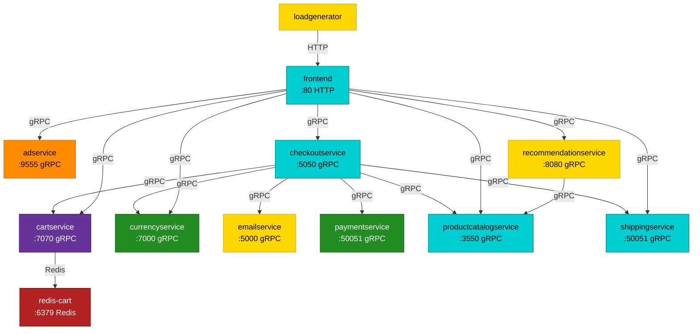

# Store Demo Architecture

This describes the service topology of the vendored Online Boutique app (`GoogleCloudPlatform/microservices-demo`, see [PROVENANCE.md](./PROVENANCE.md) for the pinned upstream version) as wired by the manifests in [`k8s`](./k8s).

> The graph and tables below are **generated** from the manifests by
> [fix_architecture.py](./fix_architecture.py). Do not edit the
> `<!-- generated:* -->` regions by hand — run the script after changing a
> manifest:
>
> ```bash
> python3 examples/store-demo/fix_architecture.py
> ```
>
> CI runs it with `--check` and fails if the doc is stale.

## Service Graph

<!-- generated:graph -->

<!-- /generated:graph -->

<!-- generated:legend -->
**Language legend:** <span style="color:darkturquoise">■</span> Go &nbsp;
<span style="color:gold">■</span> Python &nbsp;
<span style="color:forestgreen">■</span> Node.js &nbsp;
<span style="color:rebeccapurple">■</span> C# / .NET &nbsp;
<span style="color:darkorange">■</span> Java &nbsp;
<span style="color:firebrick">■</span> Redis (datastore)
<!-- /generated:legend -->

## Connections

Edges are derived from the `*_SERVICE_ADDR` / `REDIS_ADDR` / `FRONTEND_ADDR`
environment variables in the manifests.

<!-- generated:connections -->
| Caller | Callee | Address | Protocol |
| --- | --- | --- | --- |
| cartservice | redis-cart | `redis-cart:6379` | Redis |
| checkoutservice | cartservice | `cartservice:7070` | gRPC |
| checkoutservice | currencyservice | `currencyservice:7000` | gRPC |
| checkoutservice | emailservice | `emailservice:5000` | gRPC |
| checkoutservice | paymentservice | `paymentservice:50051` | gRPC |
| checkoutservice | productcatalogservice | `productcatalogservice:3550` | gRPC |
| checkoutservice | shippingservice | `shippingservice:50051` | gRPC |
| frontend | adservice | `adservice:9555` | gRPC |
| frontend | cartservice | `cartservice:7070` | gRPC |
| frontend | checkoutservice | `checkoutservice:5050` | gRPC |
| frontend | currencyservice | `currencyservice:7000` | gRPC |
| frontend | productcatalogservice | `productcatalogservice:3550` | gRPC |
| frontend | recommendationservice | `recommendationservice:8080` | gRPC |
| frontend | shippingservice | `shippingservice:50051` | gRPC |
| loadgenerator | frontend | `frontend:80` | HTTP |
| recommendationservice | productcatalogservice | `productcatalogservice:3550` | gRPC |
<!-- /generated:connections -->

## Service Languages

The node colors in the diagram above reflect the implementation language of each
service. Online Boutique is intentionally polyglot, which is why it is a good
exercise for OBI: each runtime is instrumented differently. Languages are
detected from each service's source tree under [`app/src`](./app/src).

<!-- generated:languages -->
| Service | Language | Source marker |
| --- | --- | --- |
| adservice | Java | `build.gradle` |
| cartservice | C# / .NET | `cartservice.csproj` |
| checkoutservice | Go | `go.mod` |
| currencyservice | Node.js | `package.json` |
| emailservice | Python | `requirements.txt` |
| frontend | Go | `go.mod` |
| loadgenerator | Python | `requirements.txt` |
| paymentservice | Node.js | `package.json` |
| productcatalogservice | Go | `go.mod` |
| recommendationservice | Python | `requirements.txt` |
| redis-cart | Redis (datastore) | upstream `redis:alpine` image |
| shippingservice | Go | `go.mod` |
<!-- /generated:languages -->

## Adding A New Service

Adding a service to the demo touches several places. Only the last step is automated — everything else is maintained by hand. `fix_architecture.py` derives the graph and tables from the manifests, but it does **not** create manifests, wire callers, or edit the README, so keep this checklist in mind:

1. **Source code** — add the service under [`app/src/<service>/`](./app/src) with a recognizable build marker so the language is detected: `go.mod`, `*.csproj`, `build.gradle`, `package.json`, `requirements.txt`, or `*.py` (see `detect_language` in [fix_architecture.py](./fix_architecture.py) for the priority order).

2. **Kubernetes manifest** — add `k8s/<service>.yaml`. Three rules matter for the generated topology:
   - the filename must **not** start with a digit (numbered `NN-` files are treated as infra and filtered out);
   - the workload must be `kind: Deployment` (other kinds are not picked up);
   - the Service port must declare `appProtocol: <grpc|http|redis|...>` — this is the source of truth for the protocol shown in the graph and table. A missing `appProtocol` on a called service is a hard error.

3. **Register the manifest** — add `k8s/<service>.yaml` to the `resources:` list in [k8s/kustomization.yaml](./k8s/kustomization.yaml), otherwise `kubectl apply -k` will not deploy it. (This is not checked by the generator.)

4. **Wire the callers** — add a `<NAME>_ADDR` env var (value `"<service>:<port>"`) to every service that calls the new one. Edges in the graph are derived from these env vars, so a service with no caller and no callees will not appear connected.

5. **Build & load the image** — add the service to the `services=(...)` array in the [README "Build And Load Images"](./README.md) step so its image is built and loaded into the cluster.

6. **Regenerate the doc** — run `make fix-store-demo-architecture`. CI enforces it with `make check-store-demo-architecture`.

Extend `fix_architecture.py` only when introducing something new to the model: a **new protocol** value needs an entry in `PROTOCOL_DISPLAY`; a **new language** needs an entry in `LANGUAGES` (and possibly a new marker in `detect_language`); a **non-Deployment workload** needs `manifest_services` widened.

The telemetry validation checks in the [README](./README.md) hard-code service name sets; update them too if the new service should be asserted on.
